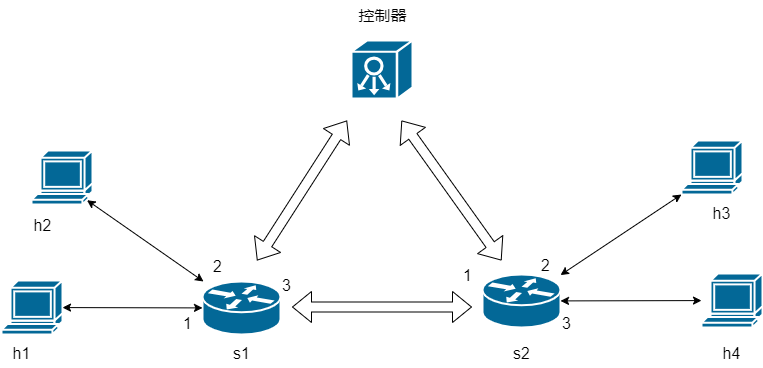
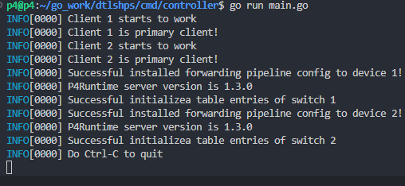
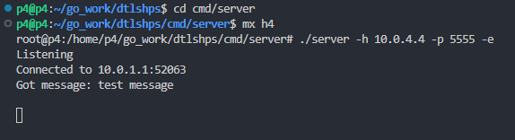
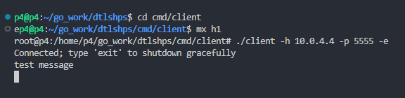

# DTLShps的控制器以及数据平面P4程序的设计实现

毕设做的东西，感觉没有啥意义，但是能让我毕业，毕竟花了不少时间和心力，留个记录作为纪念吧。。。

## 介绍

首先说下这个项目要做的东西是基于[这篇论文](https://ieeexplore.ieee.org/document/8962334)（学长发的论文）。这个项目包括的东西有P4程序的实现（p4src文件中），控制器的实现（cmd/controller文件中），端安全通信库的实现（没上传，但是有用这个库实现的客户端、服务端程序）。

1. 解决啥问题呢？物联网中资源受限节点（计算、存储能力不足）的安全通信问题

2. 怎么解决呢？用DTLS协议，但是化简版，不是说真的化简，只是引入SDN的架构，把握手过程中Cookie验证、密钥协商和身份认证转移到SDN控制器上完成，这样资源受限节点的计算资源要求就小了

3. 为啥要用P4呢？握手过程的消息要上传SDN控制器，但是DTLS消息数据应用层范畴，怎么识别出来呢？要用可编程的数据平面技术定制交换机对数据包的处理行为

## 参考的东西

参考过很多，但忘了不少，写点主要的吧。。。

- 控制器P4Runtime客户端的封装从antoninbas[p4runtime-go-client](https://github.com/antoninbas/p4runtime-go-client)修改而来，就改了客户端启动过程中所做初始处理，以及数据平面上传消息的处理方式

- DTLS消息的序列化、反序列化以及握手消息的处理模型等部分基本都是参考pion开源的[dtls](https://github.com/pion/dtls)项目

- 客户端/服务端库就是直接在pion的[dtls](https://github.com/pion/dtls)实现中修改的，就不发了，cmd文件中倒是提供了用修改过的库实现的客户端、服务端程序

- 测试环境搭建使用的是[P4官方教程](https://github.com/p4lang/tutorials)中教学用的脚本，在Python启动脚本中添加了打开simple_switch的CPU_PORT的命令，CPU_PORT端口号设置成[P4Runtime技术规范](https://p4.org/p4-spec/p4runtime/v1.3.0/P4Runtime-Spec.html)建议的14

## 测试方式

首先需要有P4的运行环境，配置很麻烦，直接用的已经配置好的[虚拟机镜像](https://github.com/nsg-ethz/p4-utils/tree/master/vm)。还要装Go的工具包，其它的应该就没什么了。

先从项目根目录执行如下命令:

```sh
cd p4src
make
```

这个脚本会编译P4程序，把生成的p4info和json文件放到build文件中，然后执行Python脚本用Mininet搭建网络拓扑，并进入Mininet命令行窗口。网络拓扑是通过p4src文件下的topology.json配置的，测试用的拓扑如下：



各节点的信息在topology.json文件中查看，其实两个主机节点就够测试。。。

新打开三个命令行窗口，分别进入控制器、客户端、服务端程序所在的目录，在一个窗口下启动控制器：

```sh
cd cmd/controller
go run main.go
```

启动结果如下图所示：



连接到两个交换机，并下发了P4交换机的转发管道流水线配置（P4程序生成的p4info和json文件），这时终端节点直接就能通信了。

以节点h4和h1通信为例，在另一个窗口，首先进入h4，启动服务端程序：

```sh
cd cmd/server
mx h4
./server -h 10.0.4.4 -p 5555 -e
```

在最后一个窗口中启动客户端程序，并发送一条消息：

```sh
cd cmd/client
mx h1
./client -h 10.0.4.4 -p 5555 -e
```

测试结果如下图所示：





其实什么也看不出来。。。

实际上需要抓包看握手过程发送的数据包，或者启动时设置控制器、服务端和客户端程序的verbose参数，输出debug信息。交换机各个端口出入的数据包都生成在p4src的pcaps文件下，用Wireshark打开就可以查看了，太麻烦了就略过了。。。

> 项目中有个别没用到的文件，但没删